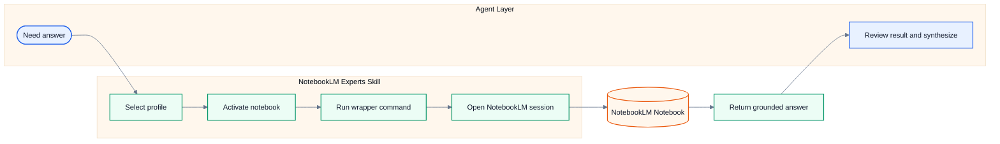

# NotebookLM Experts

Local GitHub Copilot skill for querying Google NotebookLM notebooks with source-grounded answers.

It handles profile auth, notebook selection, and browser-driven queries. The agent still owns planning, follow-up, and final synthesis.

## What This Project Does

- Queries a selected NotebookLM notebook with one explicit question at a time
- Manages local Google auth profiles and per-profile notebook libraries
- Runs through wrapper scripts inside an isolated Python environment

## Best Fit

Use this project when you already have sources inside NotebookLM and want Copilot to retrieve grounded answers from those notebooks.

Do not use it as a standalone app, an MCP server, or an autonomous research system.

## Workflow



## Quick Start

```bash
python install.py
```

```bat
.\run.bat auth_manager.py setup --name "Work Account"
.\run.bat notebook_manager.py add --url "https://notebooklm.google.com/notebook/..."
.\run.bat ask_question.py --question "What does this notebook say about authentication?"
```

Use `run.sh` instead of `run.bat` on Linux or macOS.

## Main Commands

| Task | Command |
|---|---|
| Check auth | `run.bat auth_manager.py status` |
| Create or reauth profile | `run.bat auth_manager.py setup --name "Work Account"` |
| List notebooks | `run.bat notebook_manager.py list` |
| Add notebook | `run.bat notebook_manager.py add --url "https://notebooklm.google.com/notebook/..."` |
| Activate notebook | `run.bat notebook_manager.py activate --id notebook-id` |
| Ask question | `run.bat ask_question.py --question "..."` |

## Core Scripts

| Script | Purpose |
|---|---|
| `ask_question.py` | Query one notebook with one explicit question |
| `auth_manager.py` | Manage profiles and authentication |
| `notebook_manager.py` | Manage the local notebook library |
| `add_profile.py` | Guided interactive profile setup |
| `check_notebooks.py` | Validate stored notebook entries |
| `cleanup_manager.py` | Clean local runtime data |

## Requirements

- Python 3.9+
- Google Chrome
- A Google account with NotebookLM access
- At least one prepared NotebookLM notebook

## Runtime Data

Local state is stored under `data/`.

- `profiles.json`: profile registry
- `profiles/<id>/auth_info.json`: auth metadata
- `profiles/<id>/library.json`: notebook library
- `profiles/<id>/browser_state/`: browser session state
- `logs/`: optional runtime logs

## Limitations

- Each question opens a fresh browser session
- Sources must already exist in NotebookLM
- Query limits depend on the Google account
- Browser automation is slower than direct API access

## More Documentation

- `SKILL.md`
- `references/api-reference.md`
- `references/best-practices.md`
- `references/troubleshooting.md`

## License

MIT. See `LICENSE`.
