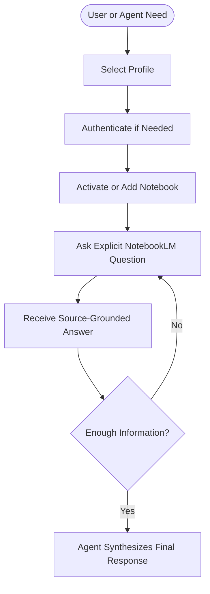

# NotebookLM Experts

Source-grounded NotebookLM workflows for GitHub Copilot.

This repository packages a local skill that lets GitHub Copilot query user-prepared Google NotebookLM notebooks, manage local auth profiles, and work with a per-profile notebook library. It is designed as a connector workflow, not as a standalone application or an autonomous research agent.

## Overview

NotebookLM Experts gives an agent a controlled way to ask explicit questions against a selected NotebookLM notebook and retrieve answers grounded in the notebook's sources.

The skill handles the operational layer:

- authenticating a local Google account profile
- storing notebook metadata in a local library
- opening NotebookLM in an automated browser session
- submitting one explicit question at a time
- returning the result so the agent can continue reasoning in chat

The agent still owns the higher-level work:

- deciding when NotebookLM is the right tool
- choosing the right notebook and question sequence
- identifying gaps, edge cases, and follow-up questions
- synthesizing the final answer for the user

## Why This Exists

NotebookLM is useful when source material already lives inside a notebook, but agent workflows still need a reliable local bridge for:

- explicit, repeatable queries
- reusable authentication state
- notebook selection across profiles
- wrapper-based execution inside an isolated Python environment

This repo provides that bridge.

## What It Is

- A GitHub Copilot skill package
- A local NotebookLM connector workflow
- A wrapper-first CLI toolkit for auth, notebook management, and querying
- A source-grounded retrieval layer for agent-led workflows

## What It Is Not

- Not a standalone chat product
- Not an MCP server for NotebookLM
- Not an autonomous multi-notebook research engine
- Not a replacement for agent planning, comparison, or synthesis

## Workflow



## Core Capabilities

| Capability | What it does | Primary script |
|---|---|---|
| Query notebook | Sends one explicit question to a notebook and returns the answer | `ask_question.py` |
| Manage authentication | Creates, validates, reauthenticates, and switches profiles | `auth_manager.py` |
| Manage notebook library | Adds, lists, searches, activates, exports, imports, and removes notebooks | `notebook_manager.py` |
| Guided profile setup | Walks through interactive profile creation and sign-in | `add_profile.py` |
| Validate notebook registry | Checks stored notebook links and local library consistency | `check_notebooks.py` |
| Cleanup and maintenance | Cleans local runtime data and temp artifacts | `cleanup_manager.py` |
| Skill smoke testing | Exercises core skill layers for debugging | `debug_skill.py` |

## Requirements

- Python `3.9+`
- Google Chrome
- GitHub Copilot workflows that can call local skill scripts
- A Google account with access to NotebookLM
- At least one NotebookLM notebook already prepared with sources

## Installation

Run first-time setup from the repository root:

```bash
python install.py
```

This setup script will:

- create a local `.venv/`
- install dependencies from `requirements.txt`
- install Google Chrome support for `patchright`

## Wrapper-First Usage

Normal operations should go through the wrapper scripts so execution always uses the repository's isolated virtual environment.

### Windows

```bat
.\run.bat auth_manager.py status
.\run.bat notebook_manager.py list
.\run.bat ask_question.py --question "What does this notebook say about authentication?"
```

### Linux / macOS

```bash
./run.sh auth_manager.py status
./run.sh notebook_manager.py list
./run.sh ask_question.py --question "What does this notebook say about authentication?"
```

## Quick Start

### 1. Check authentication status

```bat
.\run.bat auth_manager.py status
```

### 2. Authenticate a profile

```bat
.\run.bat auth_manager.py setup --name "Work Account"
```

If you already have a profile:

```bat
.\run.bat auth_manager.py setup --profile work-account
```

### 3. Add or activate a notebook

```bat
.\run.bat notebook_manager.py add --url "https://notebooklm.google.com/notebook/..."
.\run.bat notebook_manager.py activate --id notebook-id
```

### 4. Ask an explicit question

```bat
.\run.bat ask_question.py --question "Summarize the architecture decisions in this notebook"
```

### 5. Let the agent decide the next step

Typical follow-up flow:

1. Ask a broad question.
2. Review the returned answer for missing details.
3. Ask one targeted follow-up question for each gap.
4. Synthesize the final answer in chat.

## Typical Commands

### Authentication

```bat
.\run.bat auth_manager.py setup --name "My Account"
.\run.bat auth_manager.py status
.\run.bat auth_manager.py validate --profile work-account
.\run.bat auth_manager.py reauth --profile work-account
.\run.bat auth_manager.py list
.\run.bat auth_manager.py set-active --id work-account
```

### Notebook Library

```bat
.\run.bat notebook_manager.py list
.\run.bat notebook_manager.py add --url "https://notebooklm.google.com/notebook/..."
.\run.bat notebook_manager.py search --query auth
.\run.bat notebook_manager.py activate --id notebook-id
.\run.bat notebook_manager.py export --format json
.\run.bat notebook_manager.py import --file backup.json --strategy merge
```

### Querying

```bat
.\run.bat ask_question.py --question "What are the key constraints?"
.\run.bat ask_question.py --question "Compare the rollout phases" --notebook-id notebook-id
.\run.bat ask_question.py --question "List cited sources" --notebook-url "https://notebooklm.google.com/notebook/..."
.\run.bat ask_question.py --question "What changed recently?" --profile work-account
```

## Recommended Usage Pattern

The most reliable workflow is broad-then-narrow.

1. Select the right notebook.
2. Ask an overview question.
3. Inspect the answer for missing areas.
4. Ask targeted follow-up questions.
5. Compare across notebooks only when needed.
6. Keep the final synthesis in the agent, not in the skill.

## Repository Structure

```text
.
|-- install.py
|-- run.bat
|-- run.sh
|-- SKILL.md
|-- requirements.txt
|-- data/
|   |-- profiles.json
|   `-- profiles/
|-- references/
|   |-- api-reference.md
|   |-- best-practices.md
|   |-- troubleshooting.md
|   `-- usage_patterns.md
`-- scripts/
    |-- add_profile.py
    |-- ask_question.py
    |-- auth_manager.py
    |-- browser_session.py
    |-- browser_utils.py
    |-- check_notebooks.py
    |-- cleanup_manager.py
    |-- notebook_manager.py
    |-- run.py
    `-- runtime_logging.py
```

## Data and Privacy

Runtime state is stored locally under `data/`.

- `data/profiles.json`: registry of known profiles
- `data/profiles/<id>/auth_info.json`: profile auth metadata
- `data/profiles/<id>/library.json`: per-profile notebook library
- `data/profiles/<id>/browser_state/`: cookies, session state, and browser profile data
- `data/logs/`: optional debug and runtime logs

This repository is intended to keep operational state local to the machine running the skill.

## Limitations

- Each question opens a fresh browser session.
- The user must upload and maintain sources in NotebookLM separately.
- NotebookLM availability and rate limits depend on the user's Google account.
- Browser automation adds overhead compared with direct API access.
- Auth sessions may require refresh or reauthentication over time.

## Documentation Map

- `SKILL.md`: skill contract, boundaries, and operating model
- `references/api-reference.md`: command reference and parameter details
- `references/best-practices.md`: recommended question and workflow patterns
- `references/usage_patterns.md`: example operating flows
- `references/troubleshooting.md`: auth, browser, and rate-limit troubleshooting

## When To Use This Skill

Use it when the user:

- explicitly references NotebookLM
- provides a NotebookLM notebook URL
- wants source-grounded answers from notebook content already prepared
- needs help organizing local notebook profiles or library entries

Avoid it when the task is:

- general web research
- open-ended autonomous investigation across unrelated sources
- pure coding or reasoning work without NotebookLM content
- final synthesis that should remain in the agent response

## License

Released under the MIT License. See `LICENSE` for details.
