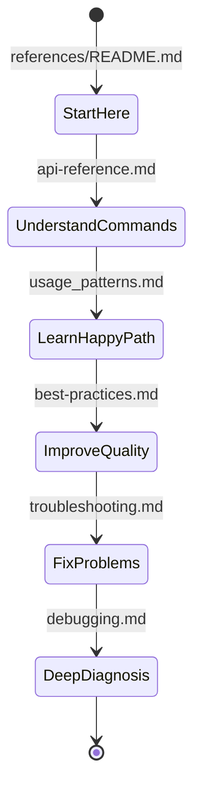
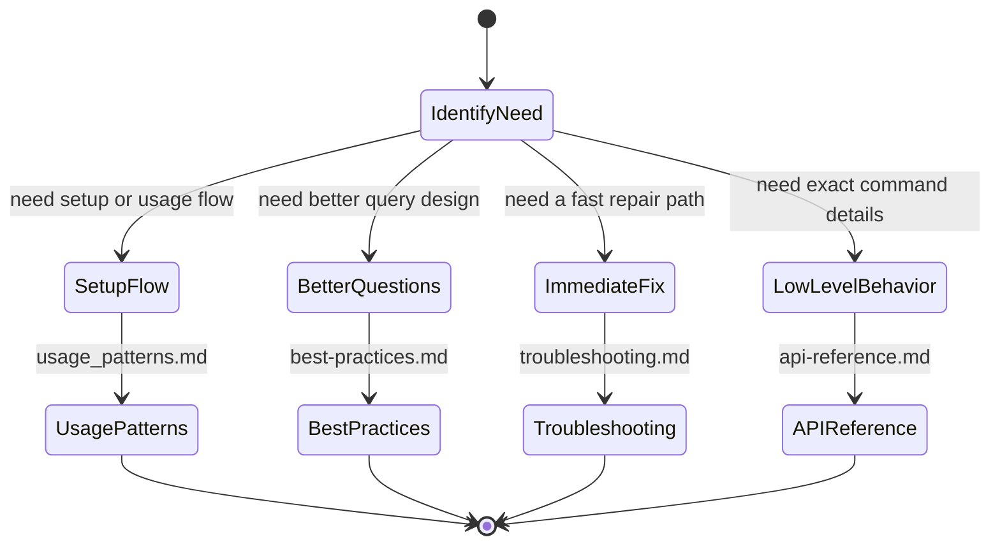
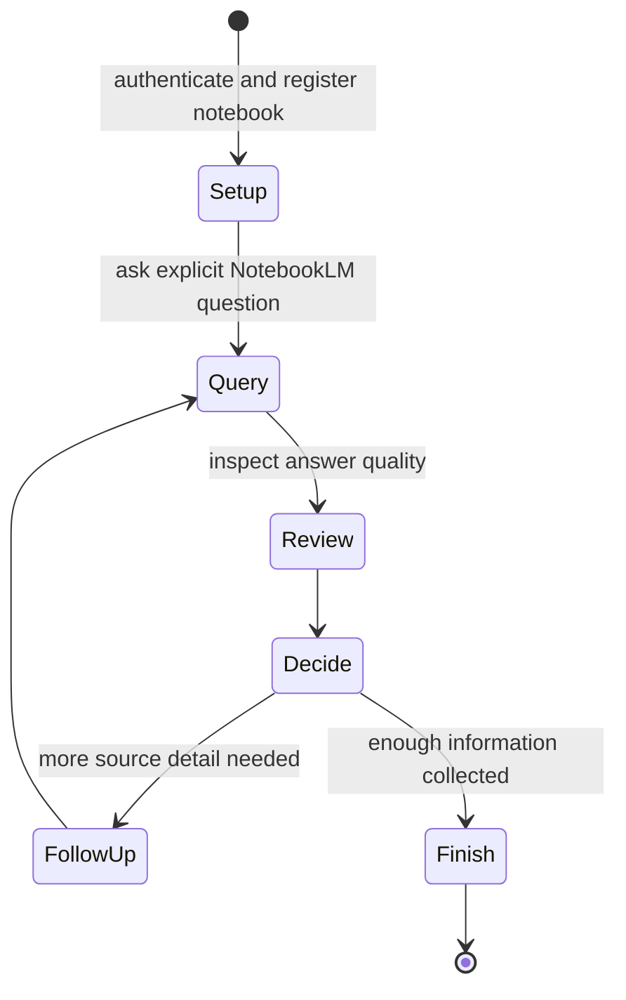

# NotebookLM Reference Documentation

This folder contains the support documentation for the NotebookLM skill. The files here are meant to help an agent or user run explicit local workflows against NotebookLM, not describe a separate application or MCP server.

## Document Map

| File | Purpose | Use It When |
|------|---------|-------------|
| `api-reference.md` | command and module reference | you need exact script behavior or supported operations |
| `usage_patterns.md` | common procedural flows | you want the happy path for setup, registration, querying, or comparison |
| `best-practices.md` | question quality and operating guidance | you want better prompts, lower query waste, or cleaner notebook organization |
| `troubleshooting.md` | error routing and recovery | you already hit a failure and need the quickest repair path |
| `debugging.md` | deeper layered diagnosis | you need to isolate whether the problem is environment, auth, browser, or notebook state |

## Recommended Reading Order



## Which File To Open First



## Typical Workflow



## Quick Entry Points

For first-time setup:
- Read `api-reference.md` and `usage_patterns.md`.

For daily work:
- Read `usage_patterns.md` and `best-practices.md`.

For failures:
- Start with `troubleshooting.md`.
- Escalate to `debugging.md` if the problem is still unclear.

## Conventions Used In This Folder

| Pattern | Meaning |
|---------|---------|
| `stateDiagram-v2` | lifecycle or decision flow |
| `<<choice>>` | decision point |
| wrapper commands | use `.\\run.bat` on Windows or `./run.sh` on Unix-like systems |
| agent-led wording | the agent decides the next step; the skill performs explicit actions |

## Key Boundary Reminder

The docs in this folder assume:
- the user already has or can provide NotebookLM notebook URLs,
- the skill runs locally in its own `.venv`, and
- the agent remains in charge of planning, follow-up, and synthesis.
                           └─────> README.md (this file)
                                   (navigation hub)
```

---

## ⚡ Critical Rules (từ state machines)

1. **Always use `.\run.bat`** — Ngăn ModuleNotFoundError
2. **Browser MUST be visible** khi auth — Never headless
3. **Follow-up when "Is that ALL you need?"** — Đừng respond user ngay
4. **Smart discovery hoặc ask user** — Never guess notebook metadata
5. **Check auth trước queries** — `auth_manager.py status` first
6. **Rate limit: 50/day** — Batch questions, cache answers
7. **5-layer debug order** — Env → Auth → Library → Browser → Links

---

## 📝 Notes

- **No duplicate content:** README này chỉ navigation + quickstart, không repeat state machine details
- **Living document:** Update khi add new state machines
- **Mermaid syntax validated:** All diagrams passed `mermaid-diagram-validator`
- **Designed for:** Quick onboarding, task routing, troubleshooting lookup
