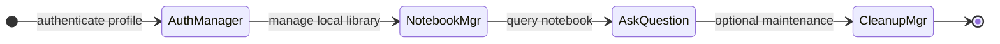
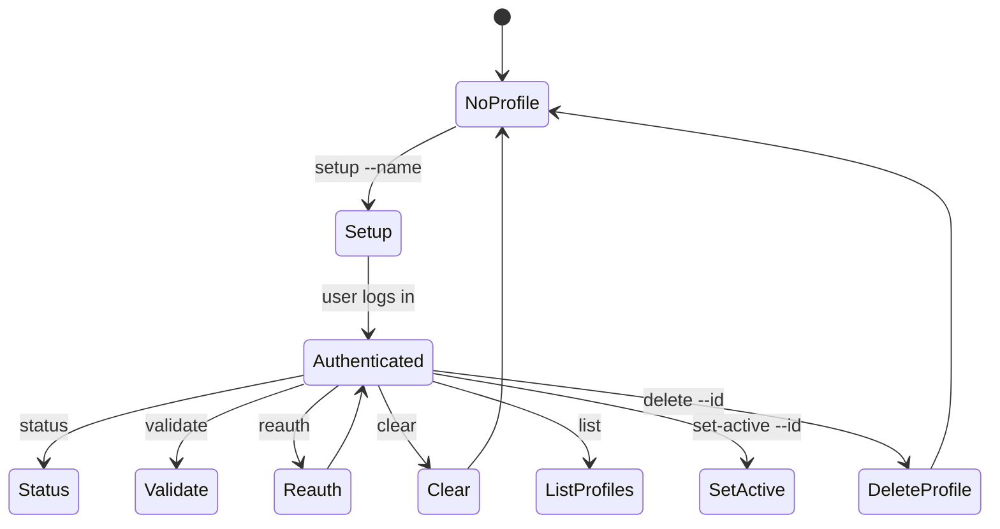
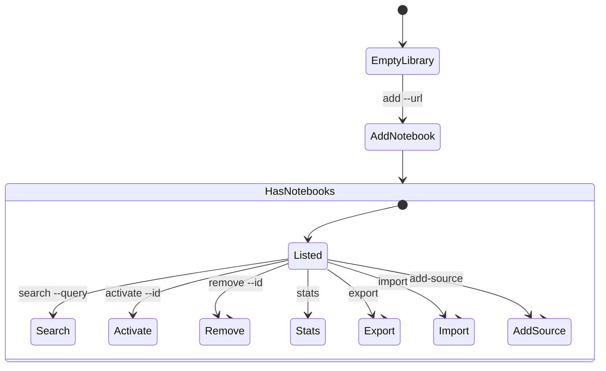
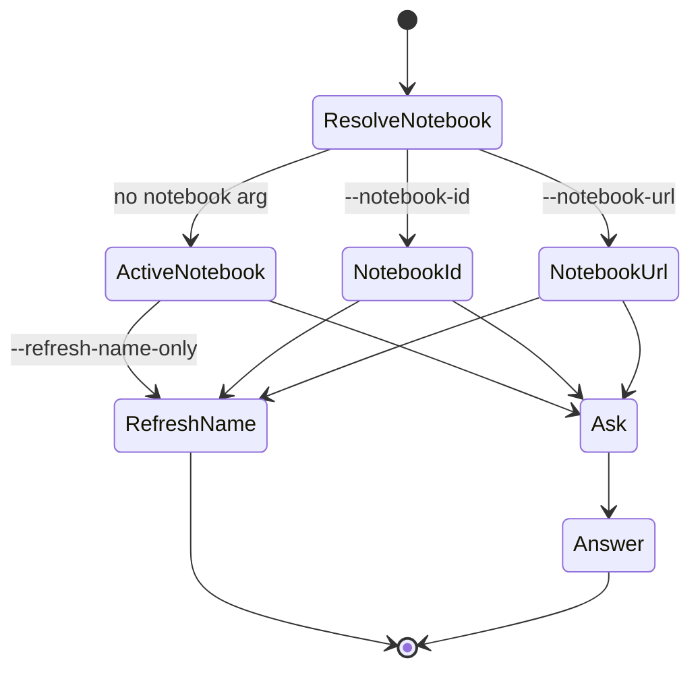
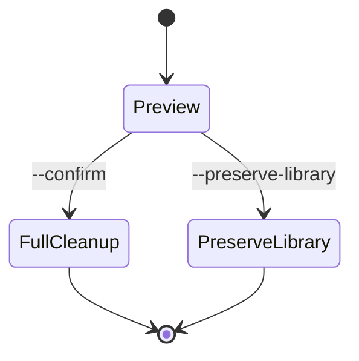

---
name: notebooklm
version: 1.0.0
description: CLI and script reference for NotebookLM skill operations
---

# API Reference

This file is the command and script reference for the NotebookLM skill. Use it to check supported commands, parameters, and storage layout.

## Overview



---

## Authentication Manager (`auth_manager.py`)

Use this script to create, validate, switch, clear, and delete local auth profiles.



### Common commands

```bat
.\run.bat auth_manager.py setup --name "Work Account"
.\run.bat auth_manager.py setup --profile work-account
.\run.bat auth_manager.py status
.\run.bat auth_manager.py status --profile work-account
.\run.bat auth_manager.py validate --profile work-account
.\run.bat auth_manager.py reauth --profile work-account
.\run.bat auth_manager.py clear --profile work-account
.\run.bat auth_manager.py list
.\run.bat auth_manager.py set-active --id work-account
.\run.bat auth_manager.py delete --id old-account
```

### Supported commands

| Command | Key arguments | Notes |
|---------|---------------|-------|
| `setup` | `--name`, `--profile`, `--headless`, `--timeout` | `--name` creates a new profile before login |
| `status` | `--profile` | Shows auth state and state file |
| `validate` | `--profile` | Checks whether auth still works |
| `clear` | `--profile` | Removes auth data for a profile |
| `reauth` | `--profile`, `--timeout` | Clears and re-runs auth |
| `list` | none | Lists all profiles |
| `set-active` | `--id` | Switches the active profile |
| `delete` | `--id` | Deletes a profile |

### Notes

- Interactive login should normally be visible to the user.
- Auth state is stored per profile under `data/profiles/<id>/`.
- `status` and `validate` default to the active profile when `--profile` is omitted.

---

## Notebook Manager (`notebook_manager.py`)

Use this script to manage the local notebook library for the active profile or a specific profile.



### Common commands

```bat
.\run.bat notebook_manager.py list
.\run.bat notebook_manager.py add --url "https://notebooklm.google.com/notebook/..."
.\run.bat notebook_manager.py add --url URL --name NAME --description DESC --topics "topic1,topic2"
.\run.bat notebook_manager.py search --query auth
.\run.bat notebook_manager.py activate --id notebook-id
.\run.bat notebook_manager.py remove --id notebook-id
.\run.bat notebook_manager.py stats
.\run.bat notebook_manager.py export --format json
.\run.bat notebook_manager.py import --file backup.json --strategy merge
.\run.bat notebook_manager.py add-source --notebook-url URL --source-url https://example.com
```

### Supported commands

| Command | Key arguments | Notes |
|---------|---------------|-------|
| `add` | `--url` required | `--name`, `--description`, and `--topics` are optional; metadata can be inferred unless `--no-fetch` is used |
| `list` | none | Lists notebooks in the current profile library |
| `search` | `--query` | Searches notebook metadata |
| `activate` | `--id` | Sets the active notebook |
| `remove` | `--id` | Removes a notebook from the library |
| `stats` | none | Shows library stats |
| `export` | `--format`, `--output` | Exports library as JSON or CSV |
| `import` | `--file`, `--strategy` | Imports library from JSON or CSV |
| `add-source` | `--notebook-url`, `--source-url`, `--no-headless` | Opens browser automation to add a web or YouTube source |

### `add` parameters

| Parameter | Required | Description |
|-----------|----------|-------------|
| `--url` | Yes | NotebookLM notebook URL |
| `--name` | No | Display name; auto-detected if omitted |
| `--description` | No | Description; auto-generated if omitted |
| `--topics` | No | Comma-separated topics; auto-detected if omitted |
| `--use-cases` | No | Comma-separated use cases |
| `--tags` | No | Comma-separated tags |
| `--no-fetch` | No | Skip metadata detection from the notebook page |

### Notes

- Notebook data is stored per profile in `data/profiles/<id>/library.json`.
- `activate` changes the default notebook used by `ask_question.py` when no notebook is passed explicitly.
- `add-source` updates NotebookLM through browser automation; it is still part of local library workflow, not a separate ingestion service.

---

## Question Interface (`ask_question.py`)

Use this script to send one explicit question to NotebookLM or refresh a stored notebook name.



### Common commands

```bat
.\run.bat ask_question.py --question "..."
.\run.bat ask_question.py --question "..." --notebook-id notebook-id
.\run.bat ask_question.py --question "..." --notebook-url "https://notebooklm.google.com/notebook/..."
.\run.bat ask_question.py --question "..." --profile work-account
.\run.bat ask_question.py --question "..." --show-browser
.\run.bat ask_question.py --notebook-id notebook-id --refresh-name-only
```

### Parameters

| Parameter | Required | Description |
|-----------|----------|-------------|
| `--question` | Yes, unless `--refresh-name-only` is used | Question to ask |
| `--notebook-id` | No | Notebook ID from the local library |
| `--notebook-url` | No | Direct NotebookLM URL |
| `--profile` | No | Profile to use; defaults to active |
| `--show-browser` | No | Show browser window |
| `--refresh-name-only` | No | Open the notebook and update its stored name without sending a question |

### Notes

- If no notebook is supplied, the script uses the active notebook.
- If no active notebook exists, the script lists known notebooks and exits with an error.
- Each question opens a new browser session.

---

## Cleanup Manager (`cleanup_manager.py`)

Use this script to preview or remove local runtime data.



### Common commands

```bat
.\run.bat cleanup_manager.py
.\run.bat cleanup_manager.py --confirm
.\run.bat cleanup_manager.py --preserve-library
```

### Notes

- Cleanup is profile-aware internally.
- `--preserve-library` keeps notebook metadata while removing temporary runtime data.
- `.venv/` is never deleted by cleanup.

---

## Data Layout

Current runtime data is stored under `data/`:

```text
<data-dir>/profiles.json
<data-dir>/profiles/<id>/library.json
<data-dir>/profiles/<id>/auth_info.json
<data-dir>/profiles/<id>/browser_state/
```

Legacy flat-layout files may still appear during migration, but profile-aware storage is the current layout.

---

## Module Reference

### `NotebookLibrary`

Key methods:

- `add_notebook`
- `list_notebooks`
- `search_notebooks`
- `get_notebook`
- `select_notebook`
- `get_active_notebook`
- `remove_notebook`
- `export_notebooks`
- `import_notebooks`

### `AuthManager`

Key methods:

- `is_authenticated`
- `get_auth_info`
- `setup_auth`
- `validate_auth`
- `clear_auth`
- `re_auth`

---

## Exit Behavior

Most scripts return `0` on success and `1` on general failure. Some wrapper-level interruptions may return different shell exit codes, so rely on command output rather than a custom per-script exit code matrix.
