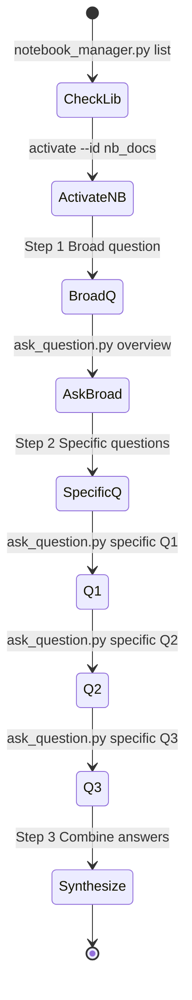
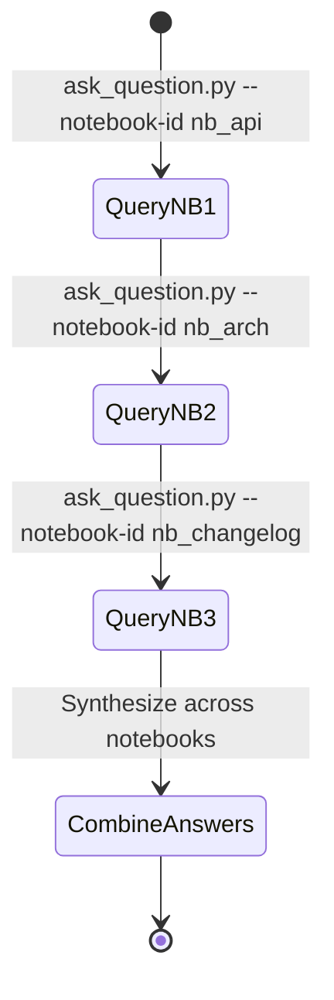
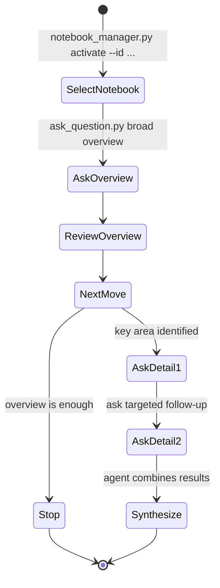
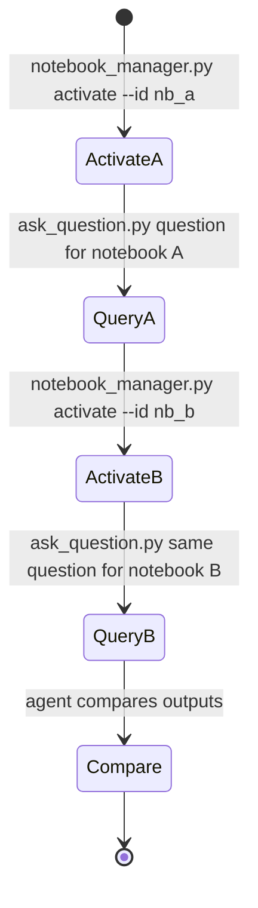
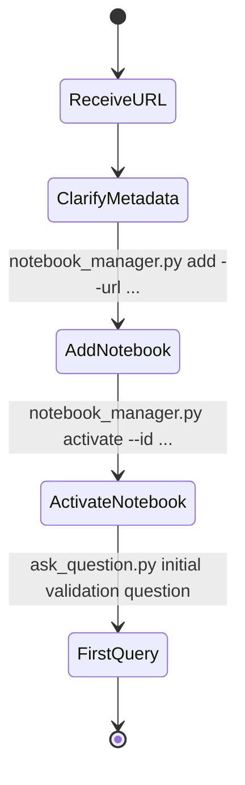
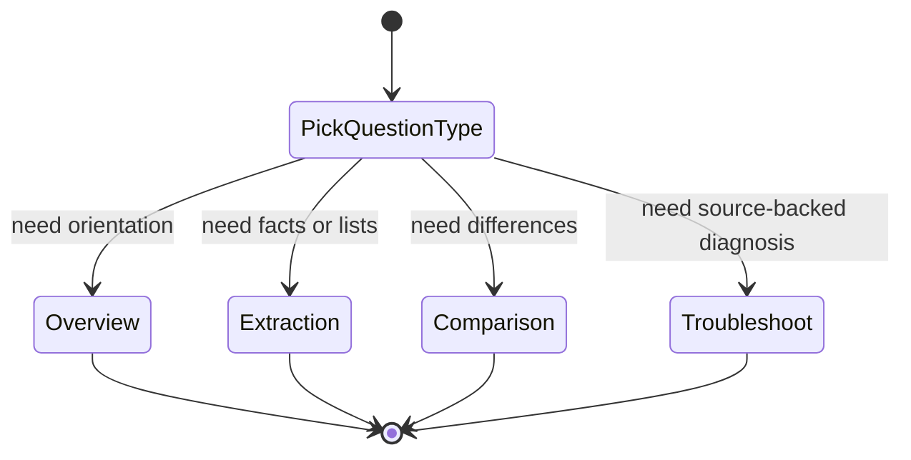
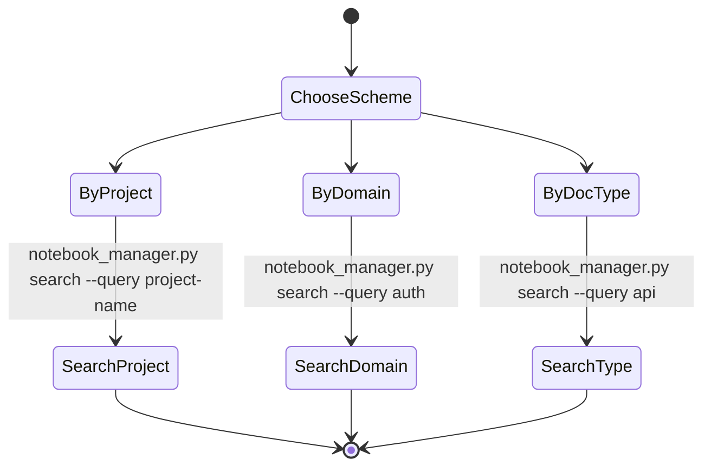
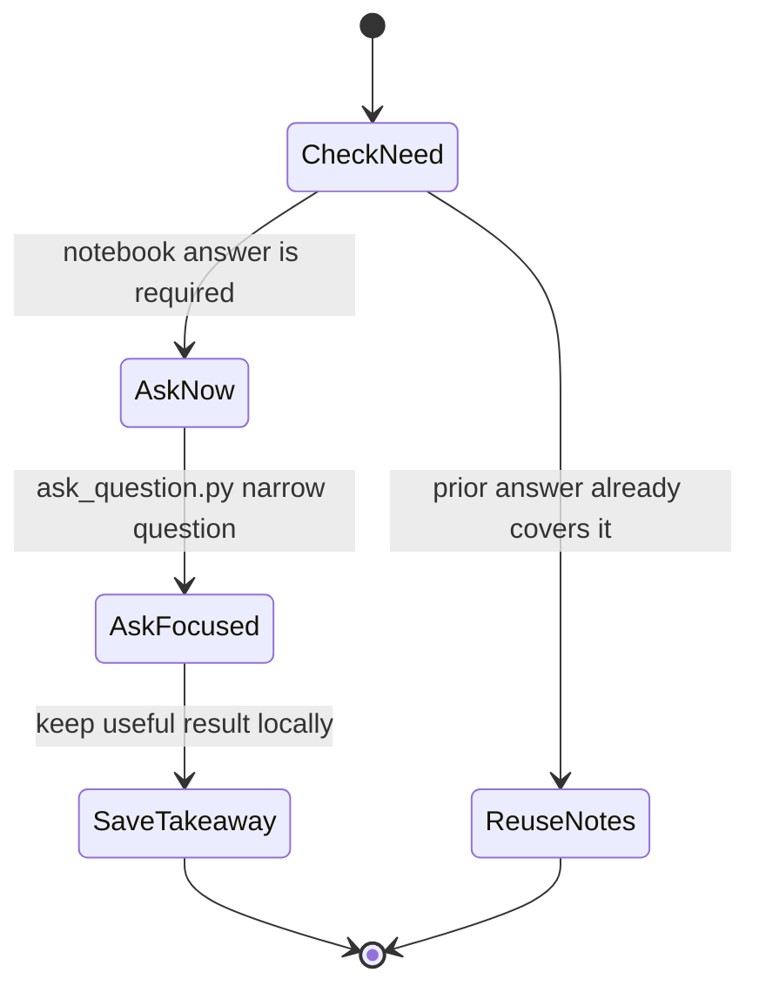
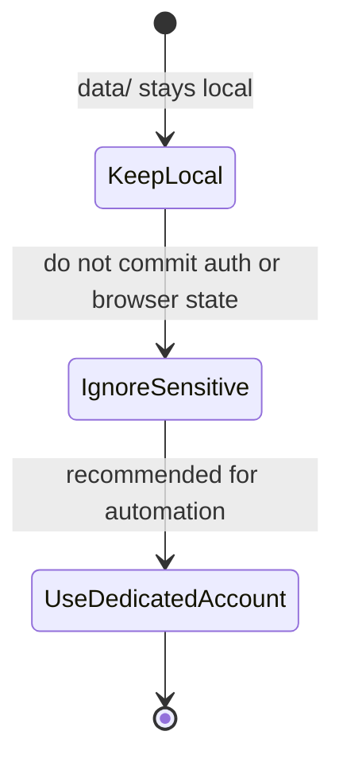
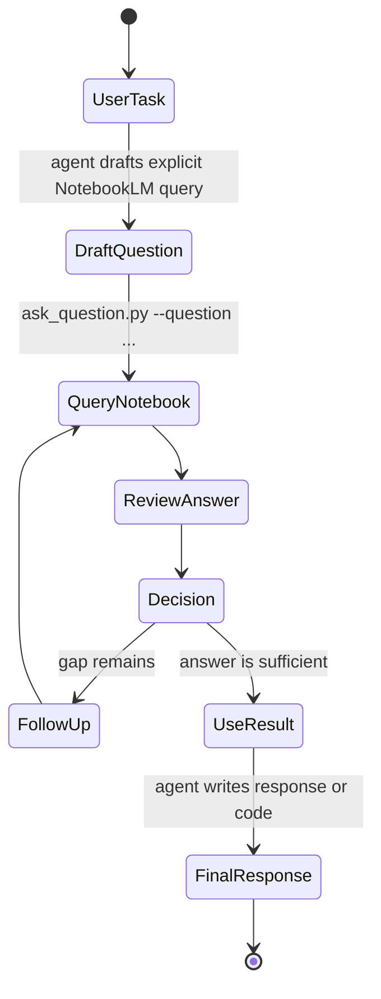

---
name: notebooklm
version: 1.0.0
description: Best practices and workflow patterns
---

# Best Practices

## Workflow Patterns

### Pattern 1: Research Session



---

### Pattern 2: Multi-Notebook Research



---
---
name: notebooklm
version: 1.0.0
description: Best practices for agent-led NotebookLM skill usage
---

# NotebookLM Skill Best Practices

This file focuses on how to use the skill well. The skill executes explicit NotebookLM operations. The agent stays responsible for selecting notebooks, asking follow-up questions, and synthesizing the final answer.

## Core Principle

Use NotebookLM for source-grounded retrieval from notebooks the user already prepared.

Do not use the skill as a substitute for planning, coding judgment, or broad open-ended research.

## Pattern 1: Broad Then Narrow



Why it works:
- The first question maps the notebook before you spend more queries.
- Later questions can reference exact sections, features, or decisions.

## Pattern 2: Compare Multiple Notebooks



Best use cases:
- Comparing APIs, policies, or architecture notes.
- Checking whether two sources describe the same workflow differently.

## Pattern 3: Register Before Relying On It



Good validation questions:
- "What is this notebook mainly about?"
- "What kinds of sources appear in this notebook?"
- "What topics does this notebook cover most directly?"

## Question Strategy



Prefer questions that are:
- Specific about the topic, feature, or decision.
- Narrow enough to answer from one notebook at a time.
- Explicit about expected output, such as list, summary, steps, or comparison.

Avoid questions that are:
- "Tell me everything about this notebook."
- "Solve this entire task for me."
- "Why did the authors think this way?" when the sources only show what they wrote.

## Anti-Patterns

| Avoid | Better Alternative |
|-------|--------------------|
| "Tell me everything." | "List the main sections and what each covers." |
| "Fix this code." | "What does the notebook say about implementing X?" |
| "Analyze all notebooks at once." | "Compare notebook A and notebook B on one topic." |
| "Keep asking until you know everything." | "Ask one follow-up per gap you can name." |

## Library Organization



Recommended metadata fields:
- `name`: short, recognizable notebook label.
- `description`: what the notebook contains.
- `topics`: searchable tags for later retrieval.

## Query Budget Management



To reduce unnecessary queries:
- Keep one notebook active when asking several related questions.
- Save useful answers in local notes instead of re-asking.
- Split large tasks into named sub-questions.

## Security And Local State



Recommended safeguards:
- Keep `data/`, `.venv/`, and browser state out of version control.
- Prefer a dedicated Google account for automation workflows.
- Re-authenticate intentionally rather than sharing one profile across unrelated work.

## Agent + Skill Integration



The skill should be one step in a larger workflow, not the workflow owner.

## Practical Examples

```bash
:: Broad orientation
.\run.bat ask_question.py --question "Summarize the main topics covered in this notebook."

:: Targeted extraction
.\run.bat ask_question.py --question "List the authentication methods documented here."

:: Comparison setup
.\run.bat notebook_manager.py activate --id nb_arch
.\run.bat ask_question.py --question "What constraints are documented for deployment?"
```

