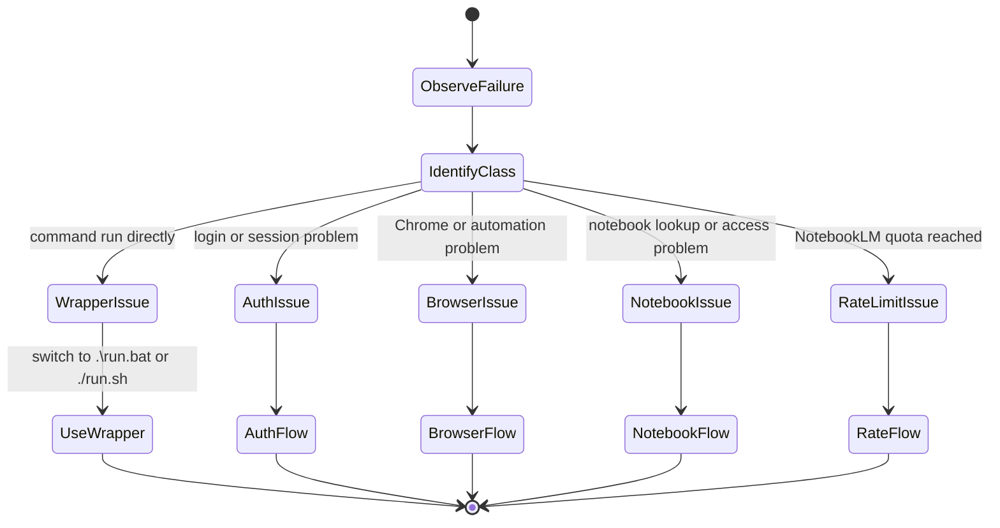
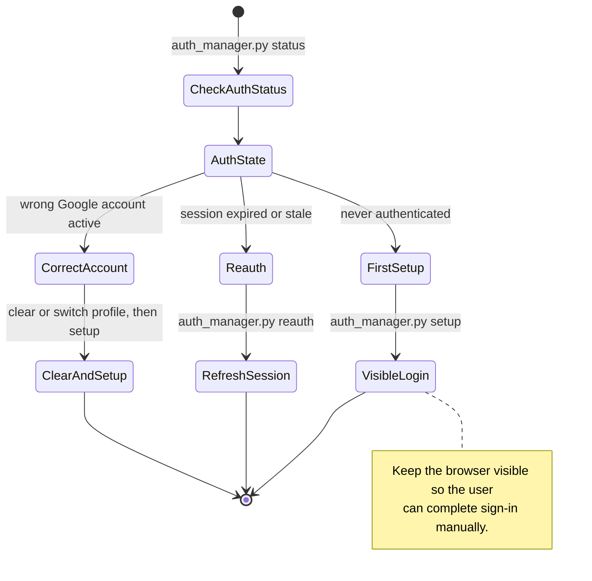
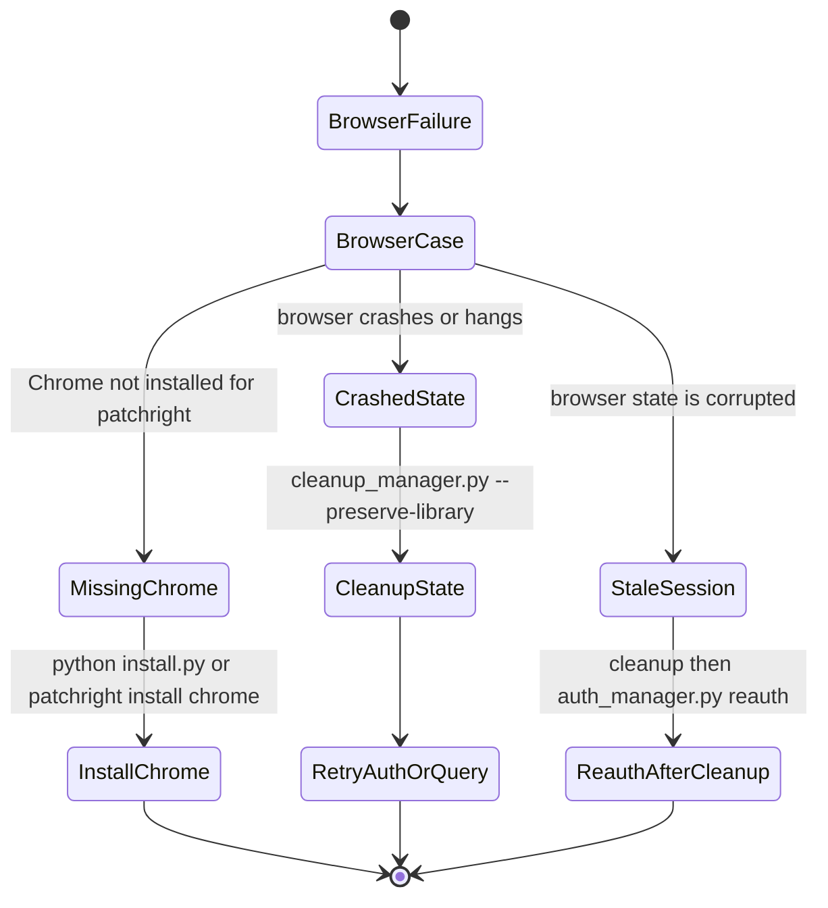
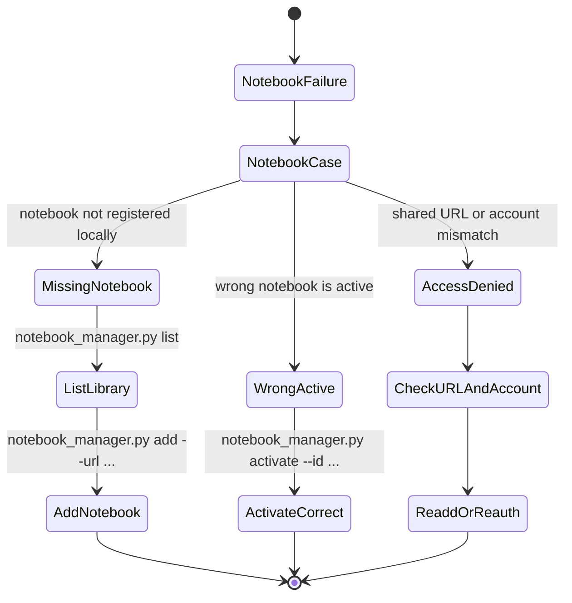
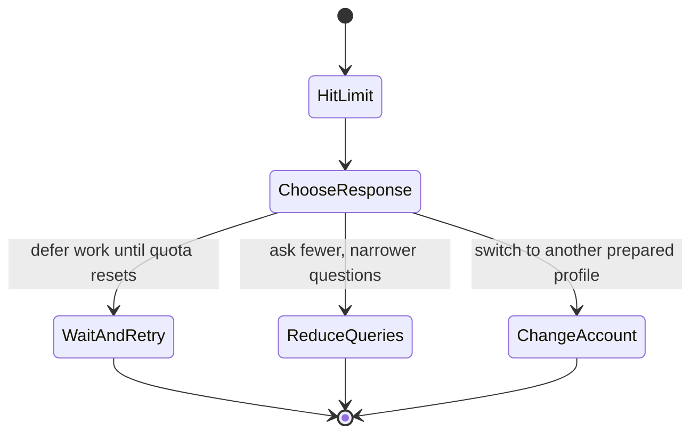
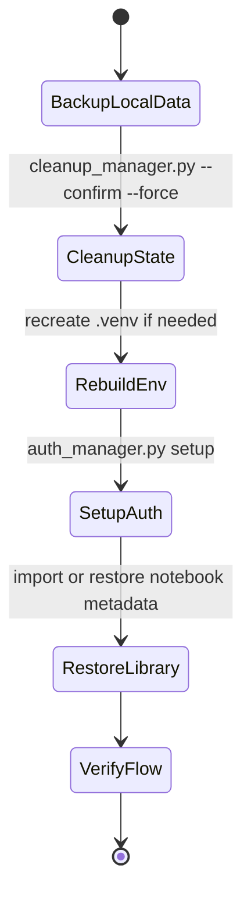

# NotebookLM Skill Troubleshooting

This file is for diagnosing failures in the local skill workflow. It does not describe an MCP server or standalone hosted service. In most cases, the fix is to restore local execution, authentication, browser state, or notebook selection.

## Error Decision Tree



## Auth Problems



Common commands:

```bat
.\run.bat auth_manager.py status
.\run.bat auth_manager.py setup
.\run.bat auth_manager.py reauth
```

## Browser Problems



Checks to perform:
- Confirm Google Chrome is available, not only Chromium.
- Re-run through the wrapper instead of invoking script modules directly.
- Clean browser state before attempting a fresh auth flow.

## Notebook Selection Or Access Problems



Useful commands:

```bat
.\run.bat notebook_manager.py list
.\run.bat notebook_manager.py add --url URL
.\run.bat notebook_manager.py activate --id NOTEBOOK_ID
```

## Rate Limit Problems



When rate limited:
- Prefer fewer, higher-value questions.
- Reuse prior answers when possible.
- Switch profiles only if that is already part of your normal setup.

## Full Recovery Flow



Safer partial recovery:

```bat
:: Recreate local environment but keep library data if you have backed it up
python install.py
.\run.bat auth_manager.py status
```

## Error Reference

| Symptom | Likely Cause | Recommended Action |
|---------|--------------|--------------------|
| `ModuleNotFoundError` | script bypassed the local environment | use `.\run.bat` |
| auth expired | saved session is no longer valid | run `auth_manager.py reauth` |
| browser launch failure | missing Chrome or stale browser state | reinstall Chrome or clean state |
| notebook not found | notebook is not in local library | run `notebook_manager.py list` or `add` |
| answer comes from wrong notebook | wrong active notebook | run `notebook_manager.py activate --id ...` |

## Prevention Tips

1. Always use `run.bat` or `run.sh` instead of calling scripts directly.
2. Keep notebook metadata organized so activation mistakes are rare.
3. Use a dedicated account if browser automation policies are strict.
4. Back up or export your notebook library before destructive cleanup.
5. Treat cleanup as a local repair step, not a normal daily workflow.

## Minimal Diagnostic Bundle

When reporting an issue, collect:

```bat
.\run.bat auth_manager.py status
.\run.bat notebook_manager.py list
.\run.bat debug_skill.py
```

Add a short note saying whether the failure is:
- before login,
- during browser automation,
- during notebook selection, or
- after the question is submitted.
