# NotebookLM Skill Usage Patterns

This file collects procedural workflow patterns for using the NotebookLM skill. These patterns are agent-led: the skill executes explicit actions, and the agent decides what to ask next.

## Pattern 1: Initial Setup Workflow

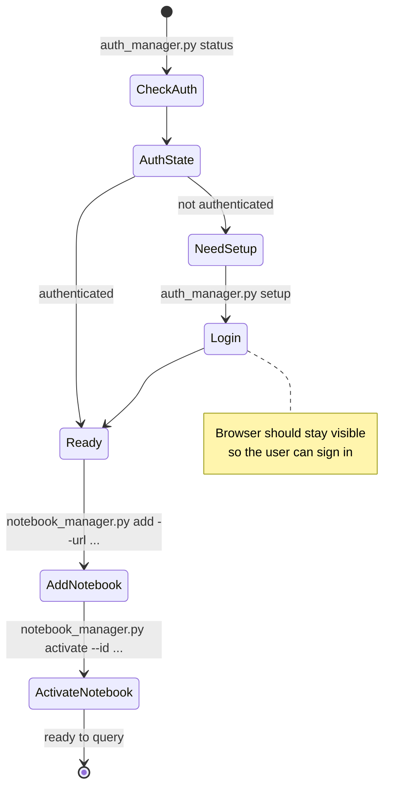

---

## Pattern 2: Notebook Registration Workflow

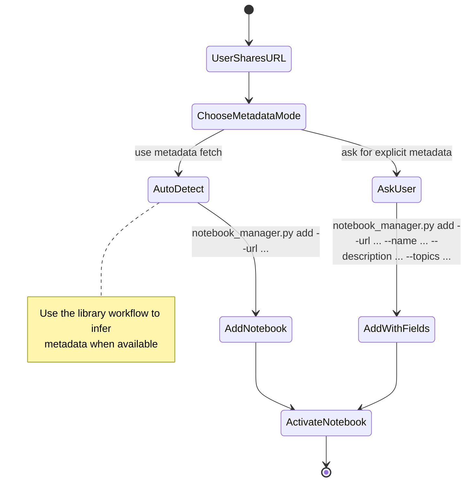

---

## Pattern 3: Daily Query Workflow

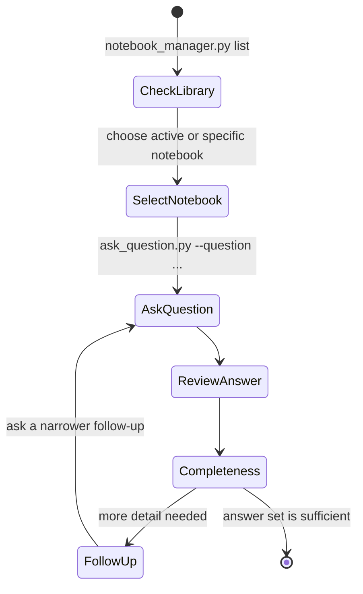

---

## Pattern 4: Follow-Up Workflow

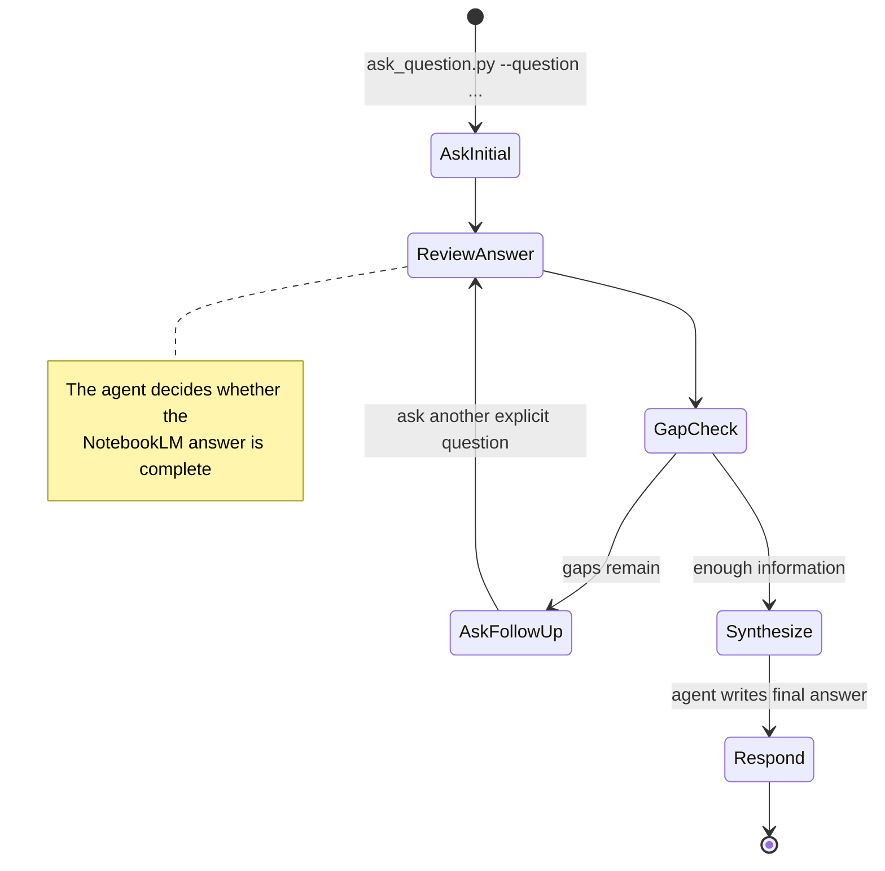

---

## Pattern 5: Multi-Notebook Comparison Workflow

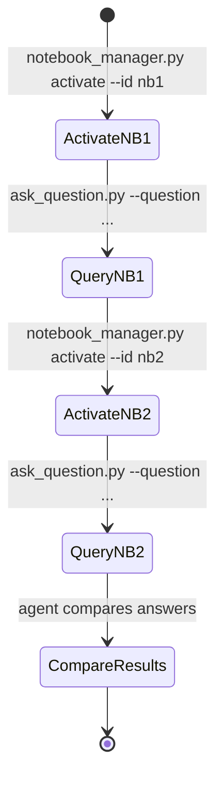

---

## Pattern 6: Error Recovery Workflow

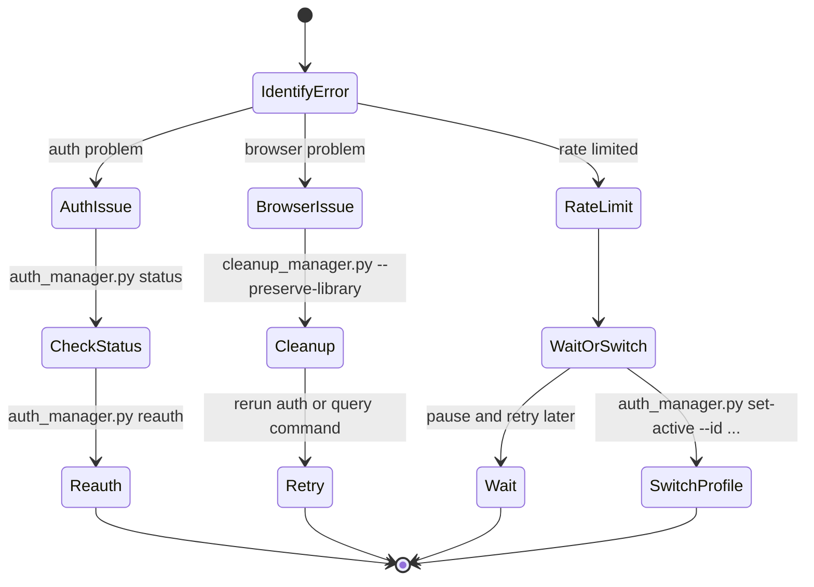

---

## Pattern 7: Batch Query Workflow

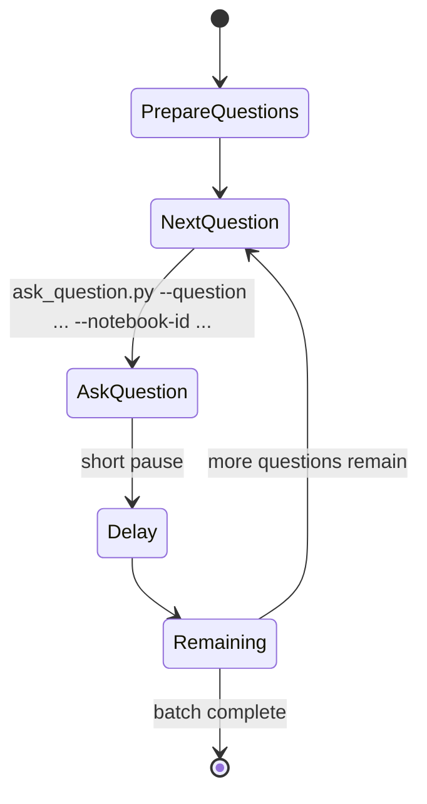

---

## Pattern 8: Notebook Organization Workflow

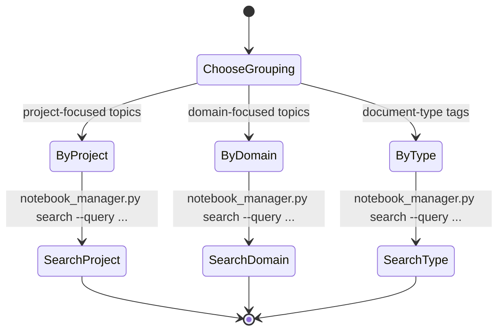

---

## Pattern 9: Library Maintenance Workflow

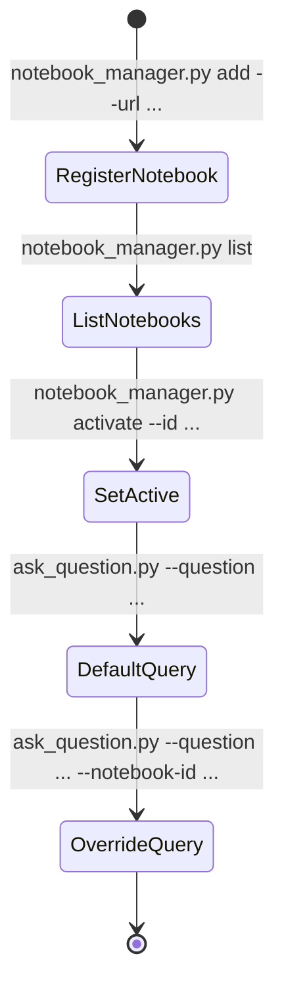

---

## Copilot Workflow: User Shares URL

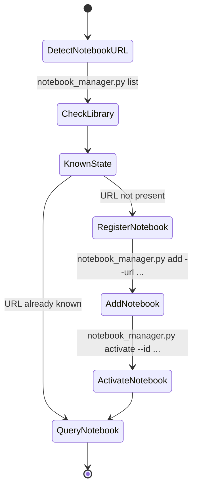

---

## Copilot Workflow: Query and Synthesis

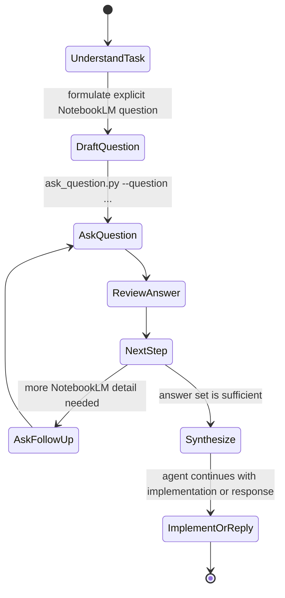

---

## Quick Reference

```bat
:: Always use the wrapper
.\run.bat [script].py [args]

:: Common operations
.\run.bat auth_manager.py status
.\run.bat auth_manager.py setup --name "My Account"
.\run.bat notebook_manager.py list
.\run.bat notebook_manager.py add --url URL
.\run.bat ask_question.py --question "..."
.\run.bat cleanup_manager.py --preserve-library
```

Use these patterns when the task is procedural. Use `references/best-practices.md` for question quality, anti-patterns, and broader guidance.
